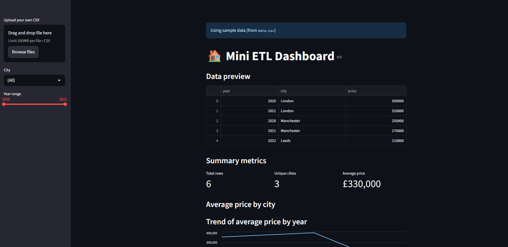

# 🏠 Mini ETL Dashboard

An end-to-end Python demo project:  
**ETL → cleaned dataset → interactive dashboard (Streamlit).**

👉 **[Live Demo](https://mini-etl-9js3fjw8g4ayb99fvaha8m.streamlit.app/)**  

---

## 📸 Screenshot




---

## 🚀 Features
- Generate & clean sample dataset (`etl.py`)
- Explore data with filters (year & city)
- Interactive charts (bar + line trends)
- Upload your own CSV for instant analysis
- Download filtered/cleaned data
- Summary KPIs (rows, unique cities, average price)

---

## 🛠️ Run Locally

Clone the repo and set up a virtual environment:

```bash
# clone repo
git clone https://github.com/roryMansell/mini-etl.git
cd mini-etl

# create environment
python -m venv .venv
.venv\Scripts\activate   # Windows
# source .venv/bin/activate   # Mac/Linux

# install dependencies
pip install -r requirements.txt

# run ETL
python etl.py

# launch dashboard
streamlit run dashboard.py
